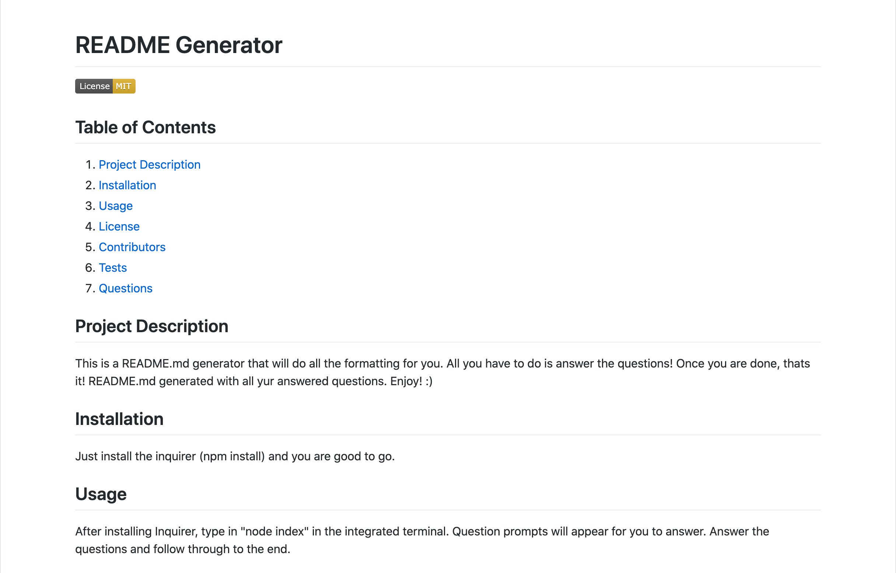
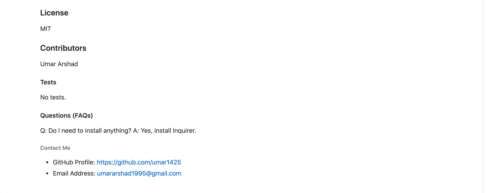

README Generator

https://github.com/umar1425/README-Generator
https://umar1425.github.io/README-Generator/

Youtube Link:
https://www.youtube.com/watch?v=hfNamN2PrRU&feature=youtu.be

For this application you start off by opening your terminal into the directory this application is stored in. Then in the terminal you type "npm install" and allow the packages to be isntalled. After they're installed, type "node index.js" and proceed to answer the following prompts:

-What is the title of your project?
-Describe the project.
-How do you install your project?
-How do you use your project?
-Which licenses did you use for your project?
-Who contributed to the creation of your project?
-What tests will you be running?
-What FAQs should users know about?
-What is your github username?
-What is your email address?

After inputting all the information a README will be placed in your Develop folder with a file named README.md. 